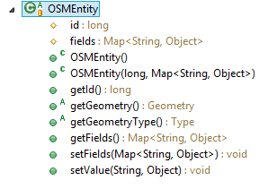

#OSMImport Tools Script reference

The current description is quite simple as there are no complex things in creating a script (several directives). The grammar could be enhanced in a next release.

##Script structure

The script file define the process to do with the OSM datas. It contains :

- the definition of the destination model structure
- the process for filtering or transformation on the OSM entities
- the mapping of the entities to a featureclass or table

All directives are placed in a builder.build section, 
	
	builder.build(osmstream) {
	
		// declarative part are placed here
	
	}

###Defining the output table / featureclass model

inside the *declarative part*, the output model is **defined** using the **gdb directive**.

		// 
		sortie = gdb(path : "c:\\temp\\t.gdb") {
			featureclass("pts", ESRI_GEOMETRY_POINT,"WGS84") {
				/* _text("k", size : 40)
				_integer("mon champ entier")
				_double("autre champ") */
				_integer('id')
			}
			featureclass("lines", ESRI_GEOMETRY_POLYLINE,"WGS84") {
				/* _text("k", size : 40)
				_integer("mon champ entier")
				_double("autre champ") */
				_integer('id')
			}
		}

in this example, the definition of the structure of the gdb is put in the variable "**sortie**". this variable is then used in the bottom of the file to define the mapping of the streams to the tables and featureclasses.

There can be multiple filegdb output if it is necessary create multiple file geodatabases in one read.

Reference documentation can help for have a look at all the options available.

##Defining the filtering / transformations

###stream directive

the **stream directive** specify a **stream of osm entities**, streams can have 2 nested directives :

- the filter (to adjust which entity will be processed)
- the transform (to modify or adjust the entities before raising them again).

for example : the below stream define a filter **and** an associated transform.

		l = stream(osmstream, label:"only id and polylines") {
	
			filter {
				OSMEntity e ->
				   e.geometryType == Geometry.Type.Polyline && e.getFields() != null
			}
			
			transform { OSMEntity e ->
				e.getFields()?.clear();
				e.setValue("id",e.id);
				return e;
			}
	
		}

osmstream variable reference the raw entities read by the tool

a "**label**" attribute permit to have comprehensive logs for the transforms.

###filter

the filter directive specify a function returning a boolean, that define of the entity can be processed be the stream.

###transform

the transform directive define a function that take an OSMEntity and return a possibly modified OSMEntity. A list of entities can also be returned for generating multiple objets in output. (for example, creating a table from relations).

@@@

OSM entities passed have the following properties :

- **id** : the id of the OSM entity
- **geometry** : the constructed geometry, belonging to the ESRI geometry API
- **fields** : a hash containing the fields values

##Defining the output binding

The last part of the directives, is the "**out**" directive. This directive permit to define the mapping between the "fgdb model" and streams.

		// flux de sortie
		out(streams : t, gdb : sortie, tablename:"pts")
		out(streams : l, gdb : sortie, tablename:"lines")
	
in the following example, the variable "t" containing a stream will be sinked to table/featureclass "pts" of the "sortie" gdb.

When writing fields in the file geodatabase, values are automatically converted in the proper format (integer, string, float, if possible), otherwise, the value is rejected and a log of the error is available.

 