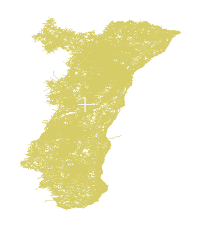
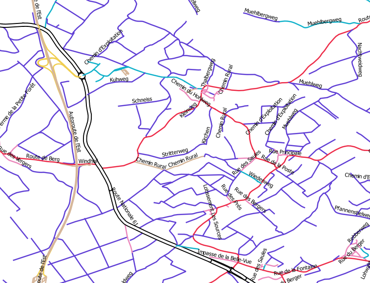

#Import streets in GDB file format

Download `alsace-latest.osm.pbf` at `http://download.geofabrik.de/europe/france/alsace-latest.osm.pbf` 

[http://download.geofabrik.de/europe/france/alsace-latest.osm.pbf](http://download.geofabrik.de/europe/france/alsace-latest.osm.pbf)

- import the streets using the `streets.groovy` sample 
- the script take a `gdb` variable for the output filegeodatabase

we use the `-p 1` to avoid creating the polygons

	C:\temp\test0.7.12\osmimport-0.7.12-SNAPSHOT>jre\bin\java -Xmx6g -jar osmimport.jar import -i alsace-latest.osm.pbf -p 1 -s scripts\streets.groovy -v gdb=streets.gdb

#Result

