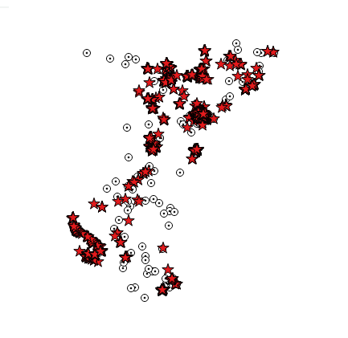

#Import hydrant in GDB file format

this example show how to import points in several featureclasses in FGDB.

Download `alsace-latest.osm.pbf` at `http://download.geofabrik.de/europe/france/alsace-latest.osm.pbf` 

[http://download.geofabrik.de/europe/france/alsace-latest.osm.pbf](http://download.geofabrik.de/europe/france/alsace-latest.osm.pbf)

- import the streets using the `fire.groovy` sample 
- the script take a `gdb` variable for the output filegeodatabase

we use the `-p 0` to avoid creating polygons and lines (save a lot of time)

	osmimport-0.7.12-SNAPSHOT>jre\bin\java -Xmx6g -jar osmimport.jar import -i alsace-latest.osm.pbf -p 0 -s scripts\fire.groovy -v gdb=fire.gdb

#Result

