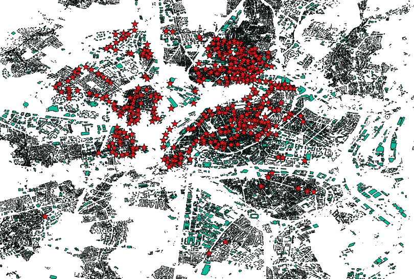

#import buildings

this example show how to construct building polygons in one featureclasses in FGDB.

Download `alsace-latest.osm.pbf` at `http://download.geofabrik.de/europe/france/alsace-latest.osm.pbf` 

[http://download.geofabrik.de/europe/france/alsace-latest.osm.pbf](http://download.geofabrik.de/europe/france/alsace-latest.osm.pbf)

- import the streets using the `buildings.groovy` sample 
- the script take a `gdb` variable for the output filegeodatabase

we use the `-p 2` to create polygons

	osmimport-0.7.12-SNAPSHOT>jre\bin\java -Xmx6g -jar osmimport.jar import -i alsace-latest.osm.pbf -p 2 -s scripts\buildings.groovy -v gdb=buildings.gdb

##Result

